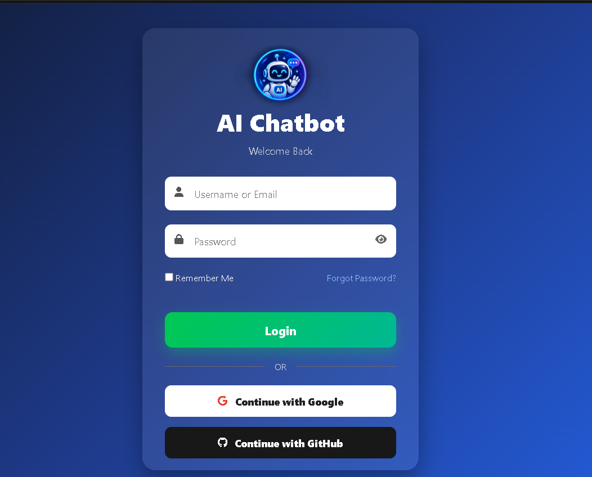
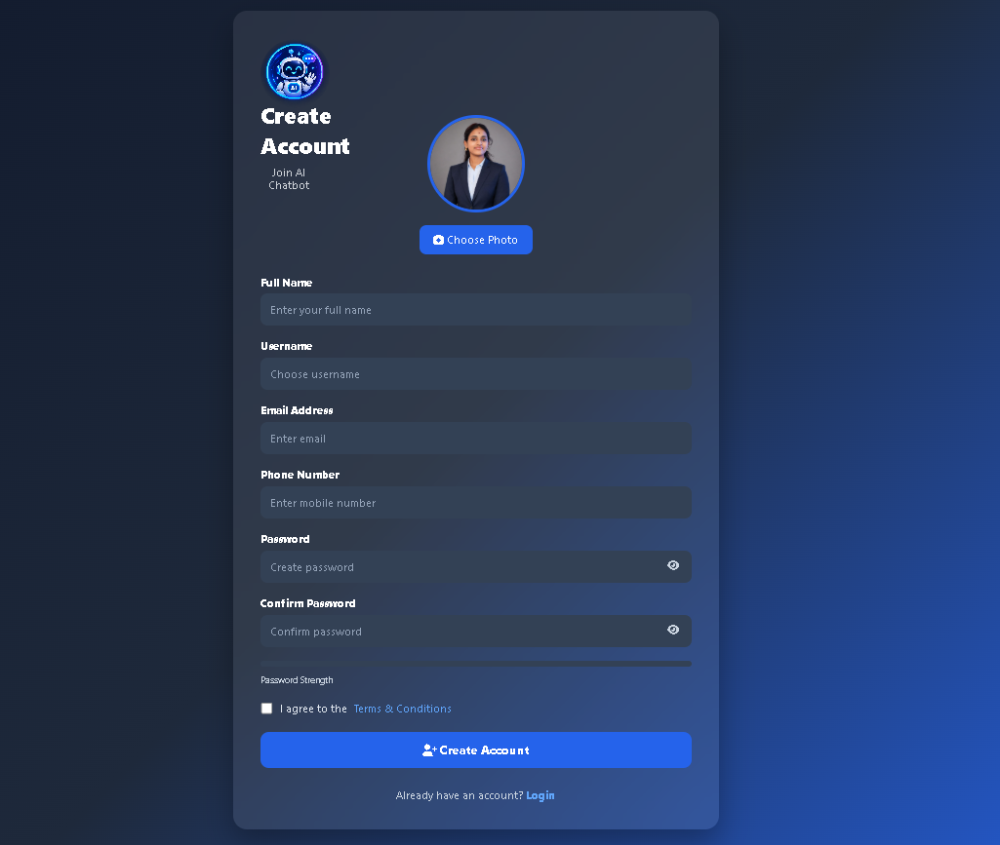
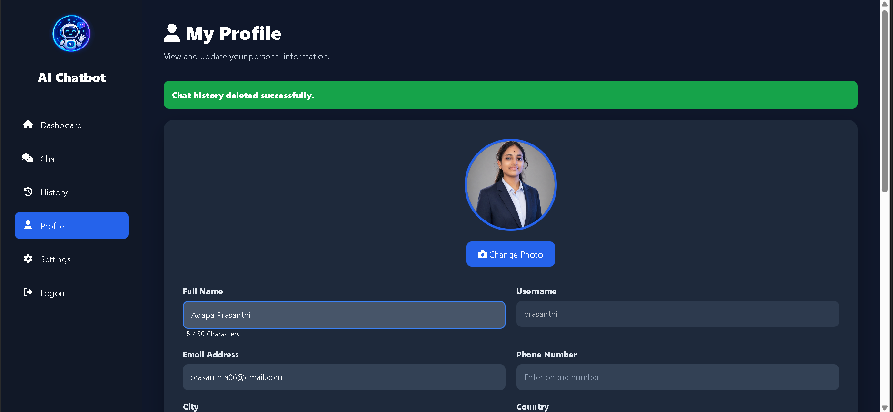

# 🤖 AI Chatbot

A modern, full-stack **AI Chatbot web application** built with **Python, Flask, HTML, CSS, and JavaScript**.  
The application provides a clean user interface with authentication, AI conversations, chat history, profile management, settings, voice input, file upload, and image analysis features.

---

## ✨ Features

- 🔐 User Registration & Login
- 👤 Profile Management
- 🖼️ Profile Photo Upload
- 💬 AI Chat Assistant
- 🧠 AI-powered question answering
- 🗂️ Chat History Management
- 🎤 Voice Input
- 📎 File Upload
- 🖼️ Image Analysis
- ⚙️ User Settings
- 🌙 Dark Mode
- 🔔 Notification Settings
- 🔑 Password Management
- 🗑️ Delete Chat History
- 🗑️ Delete Account
- 📱 Responsive and modern UI

---

## 🛠️ Technologies Used

| Technology | Purpose |
|---|---|
| **Python** | Backend development |
| **Flask** | Web framework and routing |
| **HTML5** | Page structure |
| **CSS3** | Responsive UI and styling |
| **JavaScript** | Frontend interaction and API communication |
| **SQLite** | Database management |
| **AI API** | AI-powered chatbot responses |
| **Web Speech API** | Voice input |
| **Markdown** | AI response formatting |

---

## 📁 Project Structure

```text
chatbot_p/
│
├── app.py
├── config.py
├── extensions.py
├── chatbot.db
├── requirements.txt
├── .env
│
├── static/
│   ├── css/
│   │   └── voice.css
│   ├── images/
│   │   ├── chat.png
│   │   └── prasanthi.png
│   ├── js/
│   │   ├── chat.js
│   │   ├── dashboard.js
│   │   ├── history.js
│   │   ├── login.js
│   │   ├── profile.js
│   │   ├── register.js
│   │   ├── settings.js
│   │   ├── theme.js
│   │   ├── typing.js
│   │   ├── verify_otp.js
│   │   └── voice.js
│   └── uploads/
│
├── templates/
│   ├── login.html
│   ├── register.html
│   ├── dashboard.html
│   ├── chat.html
│   ├── history.html
│   ├── profile.html
│   ├── settings.html
│   └── ...
│
└── screenshots/
    ├── 01-login.png
    ├── 02-register.png
    ├── 03-dashboard.png
    ├── 04-chat.png
    ├── 05-history.png
    ├── 06-profile.png
    └── 07-settings.png
```

---

## 🚀 Installation & Setup

### 1. Clone the repository

```bash
git clone <your-repository-url>
cd chatbot_p
```

### 2. Create a virtual environment

```bash
python -m venv venv
```

### 3. Activate the virtual environment

**Windows:**

```bash
venv\Scripts\activate
```

**macOS / Linux:**

```bash
source venv/bin/activate
```

### 4. Install dependencies

```bash
pip install -r requirements.txt
```

### 5. Configure environment variables

Create a `.env` file and add your AI API configuration.

```env
AI_API_KEY=your_api_key_here
```

> Keep API keys private and never commit `.env` to GitHub.

### 6. Run the application

```bash
python app.py
```

Open the application in your browser:

```text
http://127.0.0.1:5000
```

---

# 🖥️ Application Screenshots

## 1. Login Page

Secure login interface with username/email, password, remember-me option, and social login buttons.



---

## 2. Registration Page

New users can create an account by providing their profile information, contact details, password, and profile photo.



---

## 3. Dashboard

The dashboard provides quick access to the main chatbot features including chat, history, profile, and settings.


---

## 4. AI Chat Assistant

The main chatbot interface supports text conversations along with voice input, file upload, and image analysis.


---

## 5. Chat History

Users can view previous conversations and manage their stored chat history.


---

## 6. User Profile

The profile section allows users to view and update personal information and change their profile photo.



---

## 7. Settings

Users can customize their AI model, appearance, notifications, profile information, password, and account settings.


---

## 🔄 Application Flow

```text
Register
   ↓
Login
   ↓
Dashboard
   ↓
AI Chat
   ├── Voice Input
   ├── File Upload
   └── Image Analysis
   ↓
Chat History
   ↓
Profile / Settings
```

---

## 🔒 Security

- Passwords should be securely hashed before database storage.
- API keys are stored in environment variables.
- `.env` is excluded from version control.
- User sessions are protected through Flask session management.
- Input validation is applied to user-provided data.

---

## 🎯 Future Enhancements

- 📄 Export conversations as PDF/TXT
- 🔊 Text-to-Speech responses
- 💡 AI-generated code assistance
- 🌐 Multi-language support
- 📊 User activity dashboard
- ☁️ Cloud deployment
- 🔔 Real-time notifications
- 🎨 More customizable themes

---

## 👩‍💻 Author

**Prasanthi Adapa**

AI Chatbot — Full-Stack Python Project

---

## ⭐ Project Highlights

> A feature-rich AI chatbot application combining **Flask backend development, modern frontend design, authentication, database management, AI integration, voice interaction, and file/image processing** into a single web application.

---

## 📄 License

This project is developed for educational and portfolio purposes.
