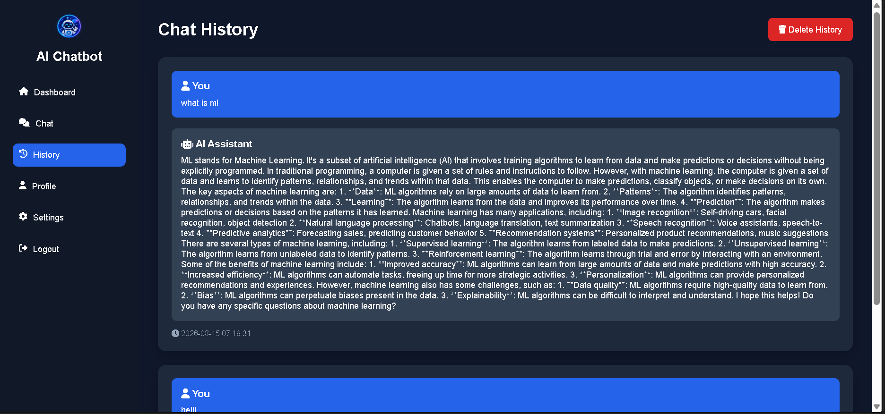
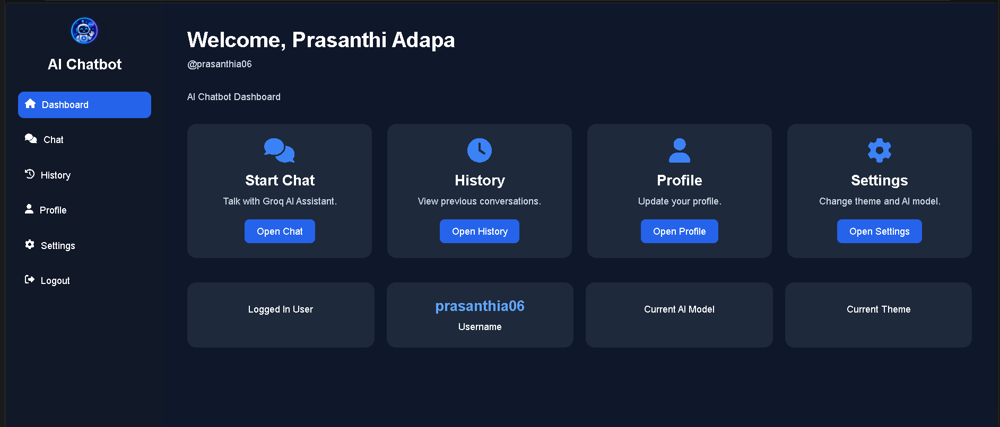
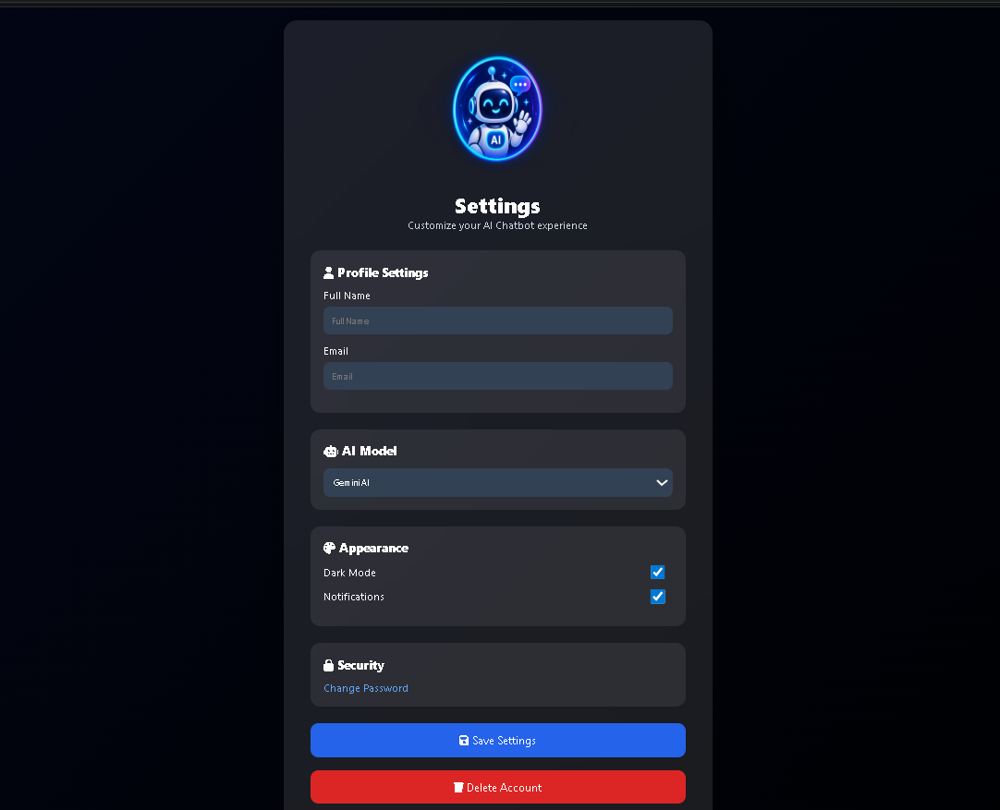
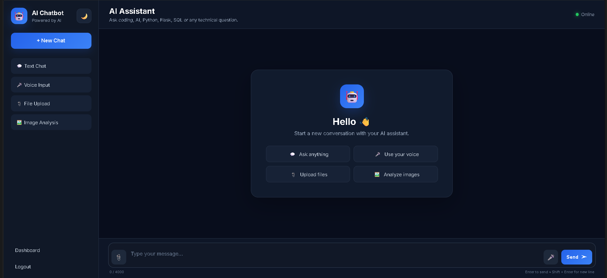

\# 🤖 AI Chatbot


> A modern, full-stack AI chatbot web application built with \*\*Flask, Python, HTML, CSS and JavaScript\*\*, designed to provide an interactive ChatGPT-style experience with authentication, AI conversations, voice input, file/image features, chat history, profile management and customizable settings.


<p align="center">

&#x20; <b>Modern UI • AI Conversations • Voice Input • Chat History • Authentication • Profile • Settings</b>

</p>


\---


\## ✨ Project Overview


\*\*AI Chatbot\*\* is a web-based intelligent assistant that allows users to communicate with an AI assistant through a clean, responsive interface.


The project combines a Flask backend with a modern frontend and includes user authentication, personalized profiles, persistent chat history and multiple interaction modes.


The application is designed as a practical \*\*AI-powered web application project\*\* suitable for learning, portfolio presentation and further production-style development.


\---


\## 🚀 Key Features


\### 💬 AI Chat

\- Interactive AI assistant interface

\- Real-time style conversation experience

\- Clean chat layout with message history

\- Supports technical and general questions

\- New Chat workflow


\### 🎙️ Voice Input

\- Voice-input interface for hands-free interaction

\- Designed to convert spoken input into text before sending it to the AI assistant


\### 📁 File \& Image Features

\- File upload interface

\- Image analysis workflow

\- Dedicated UI for uploading files and analyzing images


\### 🔐 Authentication

\- User registration

\- User login

\- Forgot password

\- OTP verification

\- Password reset

\- Google OAuth integration

\- GitHub OAuth integration

\- Password visibility controls


\### 🧠 Chat History

\- Stores previous conversations

\- Dedicated history page

\- User/AI message separation

\- Delete history option


\### 👤 User Profile

\- Full name

\- Username

\- Email

\- Phone number

\- City and country

\- Profile photo upload/change


\### ⚙️ Settings

\- AI model selection

\- Dark mode / appearance controls

\- Notifications

\- Profile settings

\- Password/security option

\- Account deletion option


\### 🎨 Modern UI

\- Responsive dashboard

\- Sidebar navigation

\- Dark-themed interface

\- Modern cards and buttons

\- Clean authentication screens

\- Mobile-friendly structure


\---


\# 🖥️ Application Screenshots


\## 1. Create Account/ Register





Users can create an account by entering their personal details, username, email and password, with password-strength and terms-and-conditions controls.


\---


\## 2. Login




The login page provides username/email authentication, password visibility, remember-me functionality, forgot-password navigation and social login options.


\---


\## 3. Dashboard


The dashboard provides quick access to:


\- Start Chat

\- Chat History

\- Profile

\- Settings

\- Current user information

\- AI model and theme information


\---


\## 4. AI Chat Interface


The main assistant interface supports multiple interaction modes:


\- Text Chat

\- Voice Input

\- File Upload

\- Image Analysis

\- New Chat

\- AI responses


\---


\## 5. Chat History


Users can review previous conversations, including their questions and AI-generated responses, and can delete chat history when required.


\---


\## 6. User Profile





The profile section allows users to view and update personal information and manage their profile photo.


\---


\## 7. Settings





The settings page provides controls for profile information, AI model selection, appearance, notifications and security.


\---


\# 🏗️ Technology Stack


| Layer | Technology |

|---|---|

| Backend | Python, Flask |

| Frontend | HTML5, CSS3, JavaScript |

| AI | AI API integration |

| Authentication | Flask authentication + OAuth |

| Database | SQLite |

| Styling | Custom CSS |

| Client-side Logic | JavaScript |

| Version Control | Git \& GitHub |


\---


\# 📂 Project Structure


```text

Chatbot\_AI/

│

├── ai/

│   ├── \_\_init\_\_.py

│   ├── chat\_memory.py

│   ├── groq\_ai.py

│   ├── prompt.py

│   └── routes/

│       └── chat.py

│

├── app/

│   ├── \_\_init\_\_.py

│   └── routes/

│       ├── \_\_init\_\_.py

│       ├── ai\_service.py

│       ├── chat.py

│       └── chat\_routes.py

│

├── auth/

│   ├── \_\_init\_\_.py

│   ├── forgot\_password.py

│   ├── login.py

│   ├── otp.py

│   ├── register.py

│   └── reset\_password.py

│

├── database/

│   ├── db.py

│   └── models.py

│

├── exports/

│   ├── export\_docx.py

│   ├── export\_pdf.py

│   └── export\_txt.py

│

├── static/

│   ├── css/

│   ├── images/

│   ├── js/

│   └── uploads/

│

├── templates/

│   ├── chat.html

│   ├── dashboard.html

│   ├── history.html

│   ├── login.html

│   ├── profile.html

│   ├── register.html

│   ├── settings.html

│   └── ...

│

├── app.py

├── config.py

├── extensions.py

├── requirements.txt

└── README.md

```


\---


\# ⚙️ Installation \& Setup


\## 1. Clone the repository


```bash

git clone https://github.com/Prasanthi2005/Chatbot\_AI.git

cd Chatbot\_AI

```


\## 2. Create a virtual environment


\### Windows


```powershell

python -m venv venv

venv\\Scripts\\activate

```


\### macOS / Linux


```bash

python3 -m venv venv

source venv/bin/activate

```


\## 3. Install dependencies


```bash

pip install -r requirements.txt

```


\## 4. Configure environment variables


Create a `.env` file in the project root.


Example:


```env

SECRET\_KEY=your\_secret\_key


GOOGLE\_CLIENT\_ID=your\_google\_client\_id

GOOGLE\_CLIENT\_SECRET=your\_google\_client\_secret


GROQ\_API\_KEY=your\_groq\_api\_key

```


> \*\*Important:\*\* Never upload real API keys, OAuth secrets, passwords or other credentials to GitHub. Keep `.env` in `.gitignore`.


\## 5. Run the application


```bash

python app.py

```


Then open the local Flask URL shown in the terminal, commonly:


```text

http://127.0.0.1:5000

```


\---


\# 🔒 Security


This project uses environment variables for sensitive credentials.


Recommended `.gitignore` entries:


```gitignore

.env

venv/

\_\_pycache\_\_/

\*.pyc

\*.db

instance/

```


Before pushing code to GitHub, always check:


```bash

git status

git diff

```


and make sure no API keys or OAuth secrets are present.


\---


\# 🔄 Application Flow


```text

User

&#x20; │

&#x20; ▼

Register / Login

&#x20; │

&#x20; ▼

Dashboard

&#x20; │

&#x20; ├──► AI Chat ───────► AI Service ───────► AI Response

&#x20; │

&#x20; ├──► Voice Input ───► Speech-to-Text ───► AI Chat

&#x20; │

&#x20; ├──► File Upload

&#x20; │

&#x20; ├──► Image Analysis

&#x20; │

&#x20; ├──► Chat History

&#x20; │

&#x20; ├──► Profile

&#x20; │

&#x20; └──► Settings

```


\---


\# 🎯 Main Use Cases


\- Ask AI technical questions

\- Learn programming concepts

\- Get Python/Flask assistance

\- Interact using voice input

\- Upload files for processing

\- Analyze images

\- Review previous conversations

\- Manage a personal profile

\- Customize AI model and application settings


\---


\# 🧪 Example Questions


```text

What is Machine Learning?


Explain Python decorators.


Create a Flask login system.


What is REST API?


Explain SQL joins with examples.


Write a Python program for binary search.

```


\---


\# 🌱 Future Enhancements


Possible improvements for future versions:


\- Streaming AI responses

\- Better speech-to-text support

\- Text-to-speech AI responses

\- Multiple AI model switching

\- Conversation folders

\- Searchable chat history

\- Drag-and-drop file uploads

\- Better image understanding

\- Export conversations to PDF/DOCX/TXT

\- Admin dashboard

\- Rate limiting and stronger production security

\- Cloud deployment

\- Docker support

\- Automated testing and CI/CD


\---


\# 📌 Project Highlights


| Feature | Status |

|---|---|

| Flask Backend | ✅ |

| AI Chat | ✅ |

| User Registration | ✅ |

| Login System | ✅ |

| Password Reset | ✅ |

| OTP Verification | ✅ |

| OAuth Login | ✅ |

| Chat History | ✅ |

| Voice Input UI | ✅ |

| File Upload UI | ✅ |

| Image Analysis UI | ✅ |

| Profile Management | ✅ |

| Settings | ✅ |

| Responsive UI | ✅ |

| GitHub Repository | ✅ |


\---


\# 👩‍💻 Author


\*\*Prasanthi Adapa\*\*


AI Chatbot Project  

GitHub: \*\*Prasanthi2005\*\*


\---


\# ⭐ Support


If you find this project useful, consider giving the repository a ⭐ on GitHub.


\---


\## 📄 License


This project is created for educational, portfolio and development purposes.


